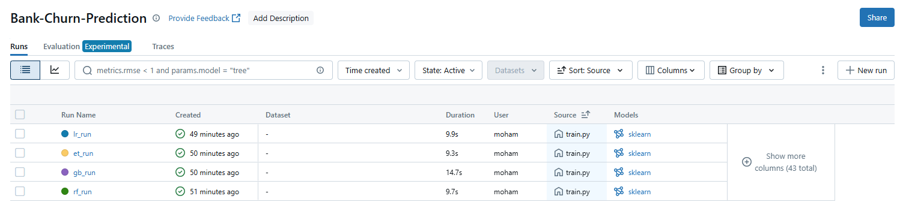
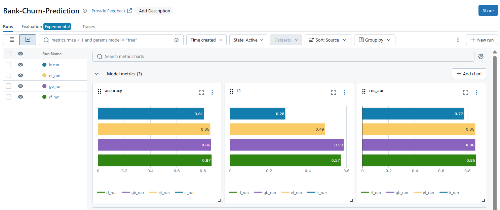

# 🔮 Bank Customer Churn – MLOps Lab

## 📦 Dataset
The dataset used is [Bank Customer Churn Prediction](https://www.kaggle.com/datasets/shantanudhakadd/bank-customer-churn-prediction/data).  
It contains customer records from a U.S. bank and the goal is to predict whether a customer will leave the bank or not (`Exited` column).

Dataset columns include:
- Customer demographics (e.g., `Age`, `Gender`, `Geography`)
- Account information (e.g., `Balance`, `Tenure`, `NumOfProducts`)
- Target variable: `Exited`

CSV file is placed under the `dataset/` folder.

---

## ⚙️ How to Reproduce

1. 📦 **Create a virtual environment**

```bash
   conda create -n churn_prediction python=3.12 -y
   conda activate churn_prediction
   pip install -r requirements.txt
```

---

2. 📥 **Download the dataset**

Download the CSV from Kaggle

Place the file in: dataset/bank-churn.csv

---

3. 🚀 **Run experiments**

```bash
# Random Forest
python src/train.py --model rf --n_estimators 300 --max_depth 8

# Extra Trees
python src/train.py --model et --n_estimators 400 --max_depth 10

# Logistic Regression
python src/train.py --model lr --c 0.5

# Gradient Boosting
python src/train.py --model gb --n_estimators 200 --learning_rate 0.05

```

---

4. 🔍 **Start MLflow UI**

```bash
    mlflow ui
```
Open http://127.0.0.1:5000 in your browser.

---

## 🗂️ Registry

models were registered in the MLflow Model Registry:

✅ Staging: (best F1 & AUC)

✅ Production: (high stability & speed)






✅ Staging: Gradient Boosting (best F1 & AUC)
Why?

F1 score is important when you care about both precision and recall — useful in churn prediction to avoid missing customers likely to leave.

ROC-AUC shows overall model discrimination capability — higher is better.

Gradient Boosting (GB) usually gives state-of-the-art accuracy but is slower to train and serve.

✅ Staging is for testing new, better models before they replace production — so the best-performing one goes here.


✅ Production: Extra Trees (high stability & speed)
Why?

Extra Trees (ET) is an ensemble method like Random Forest but:

Faster to train and serve than Gradient Boosting

More stable in predictions due to full randomness in splitting

Slightly lower performance than GB, but still good (high ROC-AUC, decent F1)

✅ Production is for real-time use — so a model that’s fast, stable, and good enough is preferred.

---

```bash
src/
│
├── churn/                 
│   ├── data.py            # load & split
│   ├── features.py        # preprocessing pipeline
│   ├── models.py          # model factory
│   ├── train.py           # CLIs -> calls churn.train()
│   └── __init__.py         
│   
│── train.py

```
---
